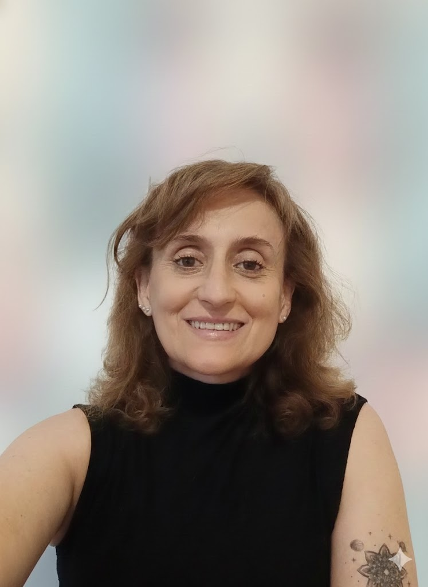
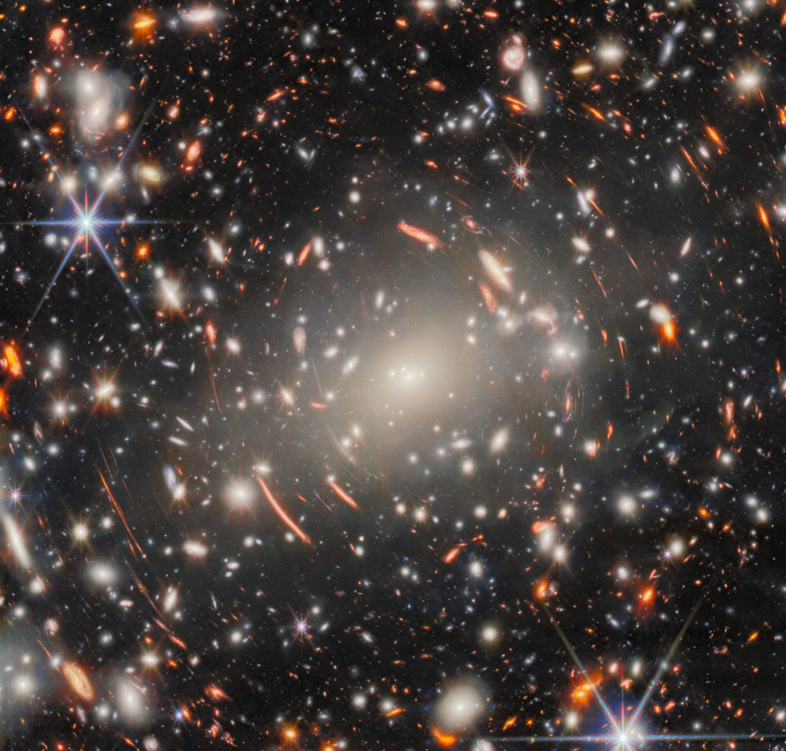

<!-- ✨ Bloque superior: Mandala + Foto personal -->

  <!-- Mandala izquierda -->
  

  <!-- Foto tuya derecha -->
  

 

<!-- 🌌 JWST centrado abajo -->

  

# Susana Pedrosa

Astrophysicist · Galaxy Formation & Evolution · Numerical Simulations & HPC  

---

- [About](#about-me)
- [Research](#research)
- [Publications](#publications)
- [Software & Tools](#software--tools)
- [Aerospace & Industry](#aerospace--industry)
- [Contact](#contact)

---

## About Me

I am an astrophysicist based at IAFE (UBA–CONICET) in Buenos Aires, Argentina.  
My research focuses on galaxy formation and evolution across cosmic time, with particular interest in:

- Angular momentum and galaxy structure
- The physics of the Cosmic Dawn and Reionization
- Cosmic Web and galaxy properties, Planes of Satellites 
- Low-surface-brightness galaxies (LSBGs)    

I work mainly with cosmological hydrodynamical simulations and numerical analysis.

---

## Research

My current and recent topics include:

- **Galaxy formation and evolution** in cosmological hydrodynamical simulations  
- **Feedback at Cosmic Dawn** (HMXBs and their impact on the ISM/IGM)  
- **Bulge/disk decomposition** and inner galaxy components
- **Chemo-dynamical analysis** of galaxies in the CIELO simulations  
- **Low-surface-brightness galaxies (LSBGs)** and angular-momentum–dark-matter coupling  

---

## Publications

A curated selection will appear here soon.  

For a complete and updated list, visit:  
👉 https://orcid.org/0000-0002-0144-8545

---

## Software & Tools

I regularly work with:

- Python, Jupyter, NumPy, pandas, Matplotlib  
- Cosmological simulations: EAGLE, TNG, FirstLight, CIELO, SWIFT  
- High-performance computing (HPC)  

---

## Exploring Industry & Aerospace Opportunities

I am actively working to bring my expertise in simulations, numerical modeling, and HPC into industry-oriented environments, particularly in aerospace. I have experience leading student teams and collaborative research efforts, coordinating technical workflows and ensuring results under demanding conditions. I am interested in opportunities where complex-system modeling, performance optimization, and scientific computing can contribute directly to technology development and mission-driven projects.

---

## Contact

- Institute: IAFE (UBA–CONICET), Buenos Aires  
- GitHub: https://github.com/su9000
- LinkedIn: https://www.linkedin.com/in/susana-pedrosa-2a876118/
- Email: susana.pedrosa@gmail.com

---

*This site is built with GitHub Pages (theme: minima).*

*This site is built with GitHub Pages.*
